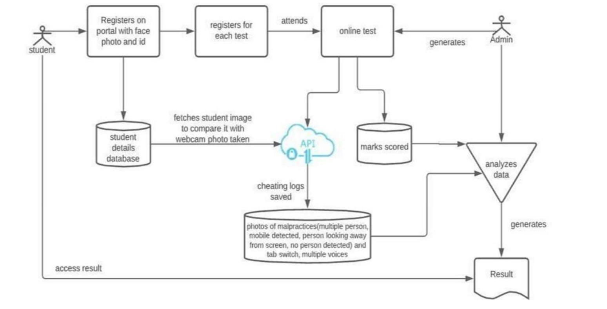

# ProctoAI

ProctoAI is an Automated Exam Proctoring System (AEPS) developed with cutting-edge AI-based algorithms for online exams. This comprehensive system is designed to ensure the integrity and security of online examinations. The project leverages technologies such as React.js, Redux, Node.js, and TensorFlow.js to offer a feature-rich exam proctoring solution.

## Table of Contents

- [Tech Stack](#tech-stack)

  - [Backend](#backend)
  - [Frontend](#frontend)

- [Current Functionality](#current-functionality)
  - [User Authentication and Role Management](#user-authentication-and-role-management)
  - [Teacher Capabilities](#teacher-capabilities)
  - [Student Functionality](#student-functionality)
  - [AI Exam Proctoring](#ai-exam-proctoring)
- [Future Scope](#future-scope)
  - [Candidate Verification](#candidate-verification)
  - [Voice Recognition](#voice-recognition)
  - [Secure Exam Environment](#secure-exam-environment)
  - [Unified Portal](#unified-portal)
- [Project Screenshots](#project-screenshots)
  - [Login Page](#login-page)
  - [Teacher Dashboard](#teacher-dashboard)
  - [Exam Page](#exam-page)
  - [Cheat Log Dashboard](#cheat-log-dashboard)
- [How to Run](#how-to-run)
- [Contributors](#contributors)
- [License](#license)

## Tech Stack

ProctoAI-MERN utilizes a range of technologies to provide its comprehensive functionality. The key technologies and dependencies used in this project include:

### Backend

- **Node.js:** A JavaScript runtime for server-side development.
- **Express:** A minimal and flexible Node.js web application framework.
- **MongoDB:** A NoSQL database for storing user data.
- **Mongoose:** An elegant MongoDB object modeling tool.
- **JSON Web Tokens (JWT):** Used for secure authentication and authorization.
- **bcryptjs:** A library for securely hashing passwords.
- **Express-Async-Handler:** Middleware to handle exceptions in asynchronous route handlers.

### Frontend

- **React:** A JavaScript library for building user interfaces.
- **Redux Toolkit:** A library for state management in React applications.
- **TensorFlow.js:** An open-source machine learning framework for web-based applications.
- **Material-UI:** A popular React UI framework.
- **React-Router:** A routing library for React applications.
- **React-Toastify:** Used for displaying notifications.
- **React-Webcam:** A React component for capturing video from the user's webcam.
- **Yup:** A JavaScript schema builder for value parsing and validation.
- **Formik:** A library for building forms in React with form validation.
- **SweetAlert:** A JavaScript library for creating beautiful and responsive alert messages.

## Current Functionality

### User Authentication and Role Management

- Students and teachers can log in with separate roles and permissions.
- Secure authentication and authorization for user accounts.

### Teacher Capabilities

- Teachers can create exams and define questions.
- Exam management for teachers, including question creation and configuration.

### Student Functionality

- Students can view available exams and participate in them.
- The test page displays questions and a timer with an auto-submit feature.

### AI Exam Proctoring

- Real-time AI proctoring of students during exams.
- AI checks for cheating behaviors, such as mobile phone detection, multiple faces detection, and absence of detected faces.
- Cheating incidents are logged and viewable by teachers in their dashboard.

## Future Scope

### Candidate Verification

- Real-time candidate identity verification through image capture and matching with registered candidates.

### Voice Recognition

- Utilization of voice recognition technology to monitor and identify voice anomalies during online exams, identifying potential malpractice.

### Secure Exam Environment

- Preventing candidates from opening or accessing unauthorized applications on their desktop or mobile devices during the online exam.

### Unified Portal

- Creation of a unified portal for users to log in, access question papers, open a chat window for communication with the examiner, and upload answer sheets via an integrated scanner within the portal.

## How to Run

To run this project locally, follow these steps:

1. Clone this repository.
2. Install the required dependencies in both the frontend and backend folders.
3. Start the server using `npm run dev` in the backend folder.
4. Start the React app using `npm start` in the frontend folder.

